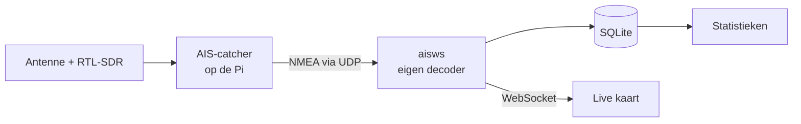

# AIS-scheepstracker Westerschelde

Een eigen ontvangststation dat de AIS-signalen van schepen op de Westerschelde
opvangt, met een live kaart en statistieken over de scheepvaart van en naar
Antwerpen. De decoder voor de AIS-berichten is zelf geschreven, zonder
AIS-bibliotheek.

<!-- Foto's van de opstelling en screenshots volgen zodra het station buiten hangt. -->

## Keten



AIS-catcher zet het radiosignaal om in NMEA-regels en stuurt die via UDP naar
`aisws`. Dat programma decodeert de berichten, houdt per schip de live toestand
bij, stuurt wijzigingen elke seconde via een WebSocket naar de kaart en slaat
uitgedunde sporen en uur-aggregaten op in SQLite.

## Wat je ziet

**Live kaart.** Schepen als rompjes op koers, groter naarmate het schip langer
is, op een ondergrond in de kleuren van een papieren zeekaart (of het
nachtpalet van een kaartscherm, in de donkere modus). Klik op een schip voor
naam, type, afmetingen, bestemming en het spoor van de laatste 6 of 24 uur.
Vanaf zoomniveau 12 staan boeien en vaargeulen van OpenSeaMap erop.

**Statistieken.**

- aantal schepen per uur (48 uur) en per dag (90 dagen)
- drukste momenten van de week, als heatmap van weekdag × uur
- gemiddelde snelheid per scheepstype
- grootste schip van de maand, op schaal getekend
- verste ontvangst ooit, met een lijn vanaf het station op de kaart

## Zonder antenne proberen

Er zit een voorbeeldbestand bij met een kwartier verzonnen verkeer op de
Westerschelde (`samples/sample.nmea`, gemaakt met `tools/make_sample.py`).

```bash
python3 -m venv .venv
.venv/bin/pip install -e '.[dev]'
cp config.example.toml config.toml   # vul [station] lat/lon in, bv. 51.443 / 3.570
                                     # en zet db_path op bv. "ais.db"
.venv/bin/aisws serve
```

En in een tweede terminal:

```bash
.venv/bin/aisws replay samples/sample.nmea --rate 3.5 --loop
```

Open `http://localhost:8000`. Speel het bestand niet veel sneller af dan de
kopregel aangeeft: dan lijken schepen onmogelijk hard te varen en verwerpt de
tracker hun posities (zie hieronder). Bij elke herhaling met `--loop` springen
de schepen terug naar het begin; de eerste posities daarna worden om dezelfde
reden verworpen.

## Op de Raspberry Pi

Zie [docs/pi-setup.md](docs/pi-setup.md): antenne, AIS-catcher, `sudo
deploy/install.sh`, controleren en problemen oplossen.

## Hoe het werkt

| Module | Taak |
|---|---|
| `nmea.py` | `!AIVDM`-zinnen ontleden, checksum controleren, tag blocks overslaan |
| `assembler.py` | berichten over meerdere zinnen samenvoegen (time-out 2 s) |
| `bits.py` | 6-bit-payload uitpakken; velden als uint, signed int en 6-bit-tekst |
| `messages.py` | types 1/2/3, 5, 18, 19 en 24 decoderen |
| `tracker.py` | live toestand, sporen uitdunnen, onmogelijke posities weren, records |
| `store.py` | SQLite (WAL): gebufferd wegschrijven, opschonen, herstel na herstart |
| `stats.py` | de vijf statistieken, in lokale tijd (ook rond de zomertijdwissel) |
| `ingest.py`, `hub.py`, `web.py` | UDP-listener, WebSocket-updates, FastAPI |

Decoder, tracker en statistieken bevatten geen I/O en zijn los te testen. Alles
draait in één proces en één asyncio-event-loop.

Een paar keuzes:

- **Uitdunnen.** Een varend schip krijgt een spoorpunt per 30 s (of eerder bij
  een koerswijziging van meer dan 10°), een stilliggend schip een per 5 minuten.
  Sporen blijven 30 dagen bewaard, uur-aggregaten voor altijd. De database
  schrijft elke 5 s in één transactie, om de SD-kaart te sparen.
- **Onmogelijke posities.** Posities verder dan 400 km van het station, of een
  sprong die meer dan 60 knopen zou vergen, tellen niet mee. Eén GPS-fout op
  (0,0) zou anders het record "verste ontvangst" voorgoed bezetten. Na drie
  afwijzingen op rij wordt de nieuwe positie toch geaccepteerd, voor het geval
  de vorige de fout was.
- **Snelheid per type** telt hoogstens één meting per schip per 30 s. Klasse A
  zendt vaker naarmate een schip harder vaart, dus zonder die grens trekken
  snelle schepen het gemiddelde omhoog.
- **Drie kleuren op de kaart** (vracht, tanker, passagiers), de rest grijs. Met
  meer kleuren door elkaar zijn niet alle paren meer te onderscheiden voor
  kleurenblinde lezers. Het precieze type staat in de lijst.

## Tests

```bash
.venv/bin/pytest
```

Ruim 200 tests, zonder SDR of netwerk. De decoder wordt gecontroleerd met
gepubliceerde voorbeeldberichten uit de gpsd-documentatie. Types 19 en 24
worden gecontroleerd met berichten die veld voor veld zijn opgebouwd volgens
ITU-R M.1371-5 (`tools/aisenc.py`). Een end-to-end-test speelt het
voorbeeldbestand via UDP af tegen de echte app.

## API

| Endpoint | Inhoud |
|---|---|
| `GET /api/vessels` | schepen die nu live zijn |
| `GET /api/vessels/{mmsi}` | details van één schip |
| `GET /api/vessels/{mmsi}/track?hours=6` | uitgedund spoor |
| `GET /api/stats/hourly`, `/daily`, `/speed`, `/heatmap`, `/largest`, `/range` | statistieken |
| `GET /api/health` | berichten per minuut, foutentellers, databasegrootte |
| `WS /ws` | snapshot bij verbinden, daarna elke seconde de wijzigingen |

## Stand van zaken

- [ ] Antenne bouwen of kopen, en een hoge plek zoeken
- [ ] AIS-catcher op de Pi installeren en eerste schepen ontvangen
- [x] Backend die NMEA decodeert en opslaat
- [x] Live kaart met MapLibre
- [x] Statistiekenpagina
- [ ] Foto's van de opstelling in deze README

## Met dank aan

[AIS-catcher](https://github.com/jvde-github/AIS-catcher) voor de ontvangst,
[MapLibre GL JS](https://maplibre.org), kaarttegels van
[OpenFreeMap](https://openfreemap.org) met data van
[OpenStreetMap](https://www.openstreetmap.org/copyright), zeekaartsymbolen van
[OpenSeaMap](https://www.openseamap.org) en het lettertype
[IBM Plex Sans](https://github.com/IBM/plex) (SIL Open Font License, zie
`src/aisws/static/fonts/OFL.txt`).
